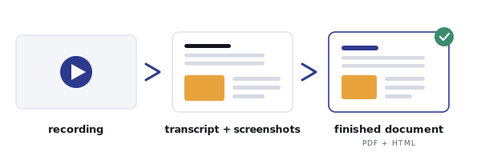

  

# content-engine

Turn a recorded video into polished, shareable documents you can actually hand to someone, without the lies that generic AI summaries smuggle in.

You record a lot: team sessions, walkthroughs, training calls, "let me show you how this works" screen shares. The knowledge is in there, trapped in hours nobody will rewatch. content-engine turns those recordings into faithful, branded deliverables (educational guides today, SOPs and more by adding a lane), where every claim traces back to something that was really said or really shown.

## For the Wildcard judge (Comp #8): one opinion, one scope call, five files

content-engine is built around one enforced opinion: every claim in a finished document
must trace back to something that was really said or really shown, and the QA gate FAILS
the document if it asserts an action, owner, sequence, or tool the source did not state.
Generic AI summaries invent steps and smooth over "actually, do it the other way."
content-engine refuses to, by construction. That single defensible stance is the asset;
everything else exists to serve it.

The scope call. I am the client (see `brief.md`), and my real problem is recurring: I
record constantly and need those recordings turned into documents I can hand someone. A
one-off folder solves one video; a recurring problem needs a repeatable machine, so the
honest scope is a specialist atom AND the factory around it. The client's own brief says
"it has to be a factory," so this is scope honored, not scope creep. It is a deliberate,
named bend of "one folder."

Why that is discipline, not sprawl: exactly ONE lane is fully wired and proven on four
real samples; the SOP lane is deliberately documentation-only (proving a new doc type is
two stages of difference, not a fork); the fidelity gate was funded before any breadth.
The proof is restraint, not coverage.

The required five-file specialist atom, mapped to where the architecture puts it:

| Required file | Lives at |
|---|---|
| `brief.md` | repo root (the client brief) |
| `identity.md` | `_config/identity.md` |
| `rules.md` | `lanes/educational-guide/reference/rules.md` (enforced by `_standards/qa-bar.md`) |
| `examples.md` | `lanes/educational-guide/reference/examples.md` |
| `reference/` | `lanes/educational-guide/reference/` |
| `README.md` | this file |

## The factory, in three lines

  

1. Configure the brand, design, voice, and render preferences ONCE (the shared shelf: `_config/` + `_standards/`).
2. Pick a lane (a self-contained workspace for one document type) and point it at a video's transcript-plus-screenshots manifest.
3. The lane extracts the real content, lays it out, and renders a brand-consistent PDF and an interactive HTML, with a fidelity audit that catches anything invented before it ships.

The factory idea: build more lanes, share what they have in common. Brand, the renderer, the schema, and the QA bar live once on the shared shelf; a new lane only specializes in WHAT it pulls out of the video and HOW it lays it out.

## The two lanes

- educational-guide (primary, wired): a recorded walkthrough becomes a learning path. Concepts, procedures, worked examples, and "by the end you'll be able to..." objectives, in dependency order, with screenshots next to the step they illustrate. This is the lane the shipped samples run.
- sop (documentation-only bonus): a recorded process becomes a step-by-step Standard Operating Procedure (actions, owners, decisions, risks). It ships as a PROSE delta (`lanes/sop/`) showing exactly how a second lane specializes off the shared shelf, without a second wired pipeline. It is the proof that adding a doc type is two stages of difference, not a fork.

## Quickstart

1. Clone the repo.
2. Run `/setup` (`setup/questionnaire.md`) to put YOUR brand on the output. The demo ships pre-branded as content-engine itself, so you can skip this to just see it work.
3. Get a manifest from a video. Two ways:
   - Use the committed samples in `samples/`: four shipped guides (rendered HTML + PDF) plus their real manifests and frames, runnable with ZERO install and zero GPU. Open the featured guide [in your browser](https://wcvessels.github.io/content-engine/samples/rendered/getting-started-claude-code.html) (or `samples/rendered/getting-started-claude-code.html` locally) to see the output; see `samples/README.md` for the full set.
   - Or run your own video through the separate, free transcription engine: install it via `00-install/`, then `transcribe-video "<your-video>"` produces a `{name}_manifest.json` plus frames.
4. Open `lanes/educational-guide/stages/01-ingest/`, point it at the manifest, and run stages 01 -> 05. Out comes a PDF and an interactive HTML.

To add a new document type (release notes, a knowledge-base article), see `_lane-builder/`: copy a blank stage skeleton, answer four questions, specialize two stages.

## Self-serve install (the transcription engine)

content-engine does NOT transcribe video itself; a separate, free, token-free tool (`transcribe-video`) does that and writes the manifest a lane reads. `00-install/` is the self-serve onboarding for it: per-OS prerequisites, the setup wizard, and a rubric that turns the engine's readiness self-test into plain-English tiers (GREEN-GPU is fast, YELLOW-CPU is correct but slow, RED means fix the listed items first). The engine is published as a public, MIT Claude Code plugin (`00-install/references/engine-location.md` has the marketplace install line); content-engine is also fully usable right now with zero install via the committed samples.

## The fidelity philosophy: clean reader surface, grounding internal

Generic summaries invent steps, drop the numbers and names that matter, and smooth over "actually, do it the other way." content-engine refuses that:

- Every claim in a deliverable is traceable, internally, to a real transcript segment or frame, via a provenance sidecar built up across the stages.
- The reader NEVER sees a timestamp, a citation, or a speaker tag. The grounding stays in `output/`, not in the document.
- A 16-item fidelity audit (`_standards/qa-bar.md`) runs before anything ships. Its sharpest check: re-read the source at each claim's cited span; if the document asserts an action, owner, sequence, tool, or branch the source did not state, it FAILS. Honest gaps are surfaced ("not covered in the recording"), never silently filled.
- Lanes that ASSERT facts (an SOP step or owner) infer nothing on content. A lane that only SEQUENCES (a learning path) may infer order, flagged internally, never adding a sentence the speaker did not say.

This fidelity machinery, not the number of render targets, is the point.

## Screenshots: cropped to what matters

When a screenshot is embedded, the layout stage decides (by vision, using one shared rule in `_skills/render-doc/frame-crop.md`) whether to trim it to the relevant on-screen content, dropping a webcam tile or participant gallery ONLY when that does not cut anything the reader needs, keeping the full frame when unsure. The render stage applies the crop deterministically with Pillow; the original frame is left untouched. The crop is optional and degrades gracefully: the default is the full frame, so nothing breaks if the step is skipped.

## Credits

- ICM (the Intelligent Context Management workspace pattern this is built on) by Jake Van Clief. MIT.
- Design inspiration from Understand-Anything. MIT.
- The shipped samples are rendered from public Jake Van Clief YouTube videos; sources attributed.

## License

MIT. Copyright (c) 2026 Will Vessels. See `LICENSE`.

---

House rule, enforced repo-wide: zero em dash characters. Plain English, low-technical audience.
